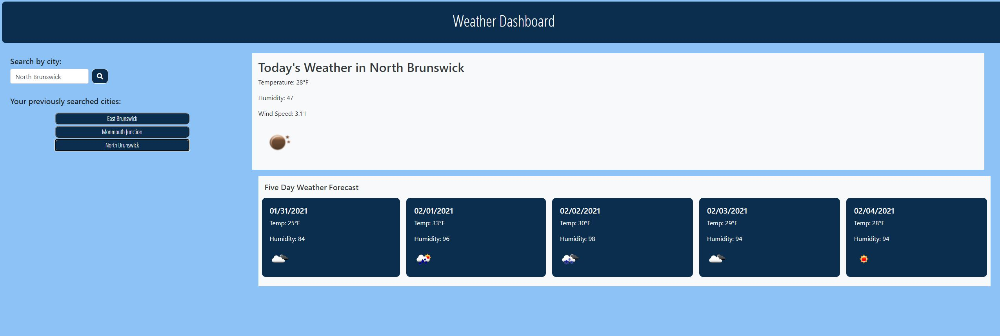

# weatherDashboard

## Description

In this assignment we are asked to creat a weather dashboard that takes in the user input and then displays the current weather of the city and the fiveday forcast.

## Mock-Up

This is first look at what the app looks like

[I am a link to the web page](https://cheetboy159.github.io/weatherDashboard/)

## Usage 

If you follow the provided link in the installation section, it will take straight to the Weather Dashboard site. The user will be able to search for weather based on city. Once they click on the search button, the city information will be stored in the local storage. The clear button will delete all cities stored in local storage. 

## License

These files don't have a license and are there to fully share.

---